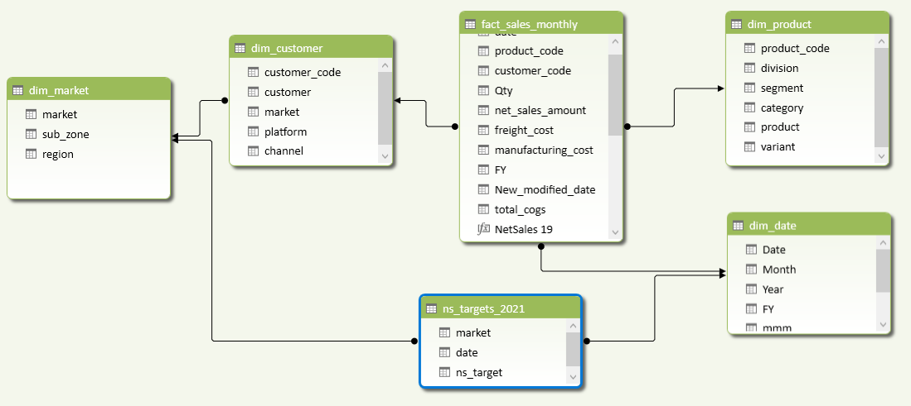

# Project : Sales Analytics using Excel
 <u></u> 
Atliq Hardware is a company moving towards advanced analytics, but Excel still has a stronghold in data-informed decision making.

## Task:
<u></u>
1. Sales Analytics : Create Customer Performance Report
2. Sales Analytics : Create Market Performance vs Target Report
3. Finance Analytics : P&L Statement by Fiscal Year Report
4. Finance Analytics : P&L Statement by Months Report

## Steps to be Followed in this project
<u></u>
1. Learned about project objectives.
3. Used CSV file as data source for retrieving data into Power Query.
4. Data Cleaning in power query and ETL (Extract, Transform, Load)
5. Exploratory Data Analysis(EDA)
6. Data Modeling and DAX in Power Pivot
7. Creating reports using Pivot Tables built on the Data Model.

## Data Modeling : Diagram View

